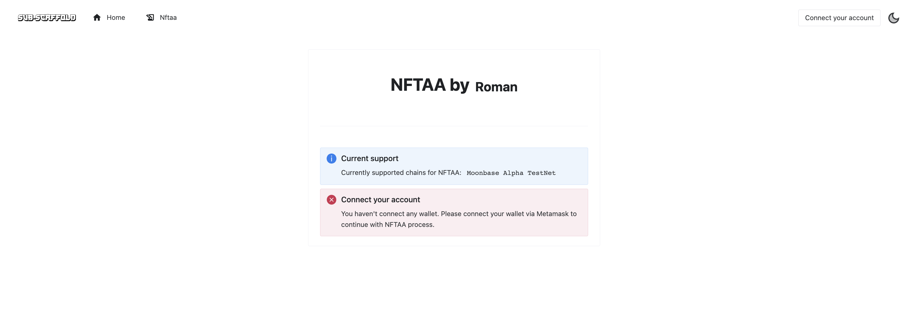
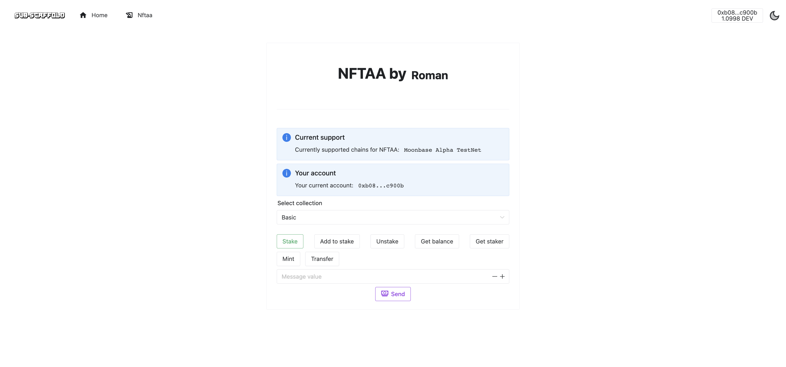

# Technical documentation

This document serves as a guide for running our solution so that it can be conveniently launched and try or run our smart contract tests.

## Requirements
- NodeJS v19+
- npm v9+
- Performant NPM at least 7.16.0
- Node Package Executor at least 9.5.0

## Hardhat
In folder nftaa_solidity, we will run command 'npm install' to install all requirements. After this, we can run 'npx hardhat test', which will execute our smart contract tests.

## Web app
To set up web application, we must go to folder nftaa_dapp and run command 'pnpm install' to install all app requirements. After this, we can run 'pnpm dev -o', which will launch our web application on port 3000 and open it in a new web browser window.

# User guide

This chapter serves as a guide for anyone who would like to use our web application.

## Requirements

- Have web NFTAA app running
- The browser used must have Metamask installed
- Metamask must have an active wallet

## Start
After opening web application and click the Nftaa button in the top navigation menu, we see a screen like in figure 1. First, we need to connect our Metamask for interaction with the blockchain.

We have a button to connect via Metamask in the top right corner. After clicking, Metamask will display a popup asking permission to connect to your web application. Confirm the connection to grant access. Metamask may also prompt you to select the Ethereum network you want to connect to.

### App functions

In figure 2, we can see the main application control buttons. We can use it in these ways:
- Stake - requires a value to be entered in the  provided field
- Add to stake - requires a value to be entered in the  provided field
- Unstake - only select and send
- Get balance - only select and send, balance will be shown in the provided field
- Get staker - only select and send, address will be shown in the provided field
- Mint - requires a description to be entered in the  provided field after sending new NFTAA is mint to the connected wallet
- Transfer - requires token id and target wallet address to be entered in the  provided fields

When the function is selected, and the required attributes are filled, we can press send button, Metamask will ask for approval, and the transaction will start processing.
